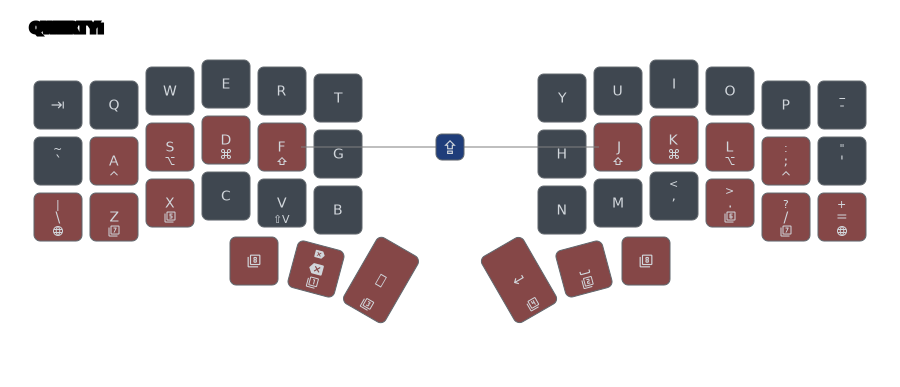
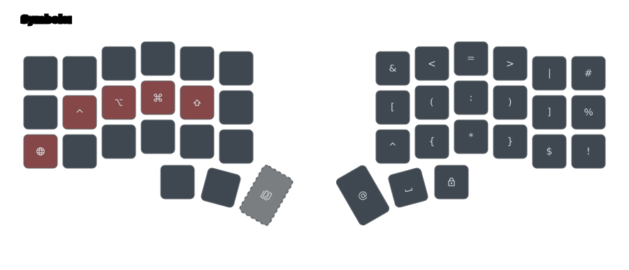
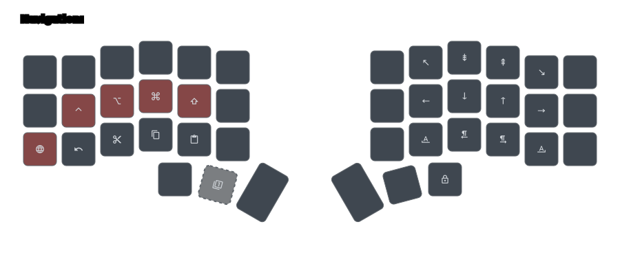
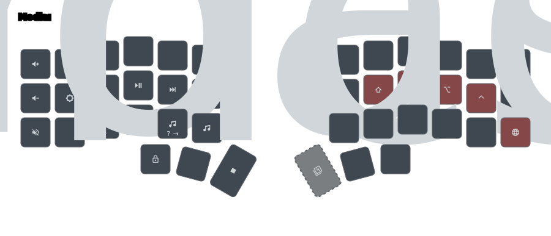
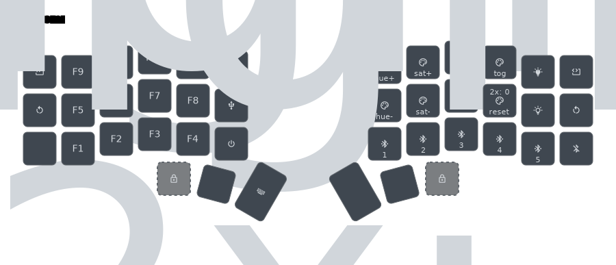
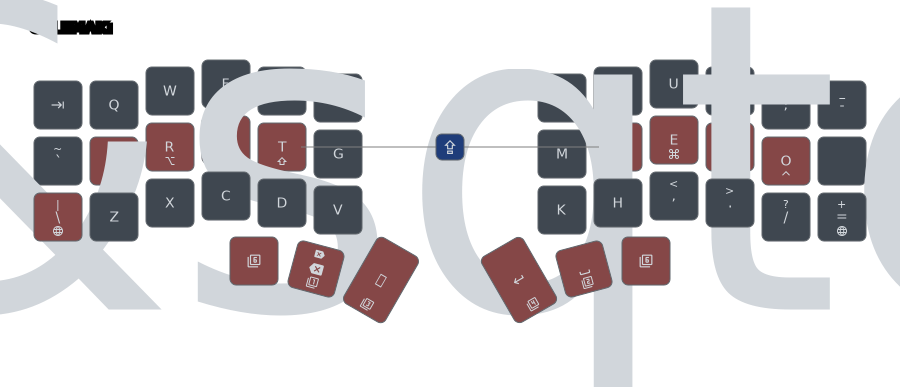

# Corne-42 Layout

My small split keyboard layout is a mashup of several excellent layouts I found
online, with a heavy seasoning of my imagination. So yes, you probably already
saw some (if not most) of the things I put in this layout somewhere else.
Nevertheless, there are some modifications I made that are worth reading about.

The first recommendation I got after jumping into the sub-50 keyboard world, was
to try the [Miryoku](https://github.com/manna-harbour/miryoku) layout. I heard
and read so much of this recommendation, that I started to think that this
should be the standard layout to use with a Corne.

The problem I have with things “ready to use”, is that everything about it, must
resonate with me if I want to use it.

Some things do… Most don't!

After deep diving into the [Miryoku](https://github.com/manna-harbour/miryoku)
layout concepts, I found myself more interested in the Layout UX Design than in
its implementation, so I decided to try to apply its concepts, on the ideas and
other layouts that I already created in the past.

The result of this, is what you're reading in this document!

Some notable features are:

- **Single-sided layers**: An extra layer should never have functional keys on
  both sides of the keyboard. If you bring a layer up using your left hand, all
  its functional keys should be located on the right side of the keyboard. This
  allows you to have accessible modifiers on the same hand that invoked the
  layer, making every layer key able to be combined with a modifier;
- **Separate layers for Symbols and Numbers**: I tried to put each one of these
  layers on different sides of the keyboard, to help my brain to identify what
  hand to use in which situation;
- **Dedicated layer of shortcuts**: The only layer that is mirrored on both
  sides of the keyboard;
- All layers are momentary, but you can lock them in place;
- Keys morph into other keys depending on the situation and requirement;
- Homerow mod configuration based on [Robert U (@urob)'s ZMK
  configuration](https://github.com/urob/zmk-config);

## Base Layer

My base layer, currently, uses a QWERTY layout, and it is where I have cramped
most features unique to this layout, like “morphed keys”, homerow mods, etc.

It is also the only layer one would modify to use a different layout with all
the features I created in this configuration. In fact, I added an _“alternative
layout”_ layer that does just that, and replaces the QWERTY layout with COLEMAK.

### Homerow mods

If you did not do it already, go read [Robert U's ZMK
configuration](https://github.com/urob/zmk-config) for details on how to
configure a _“timeless”_ homerow modifier.

The modifications I did to his configuration are basically 3:

1. I reduced the `tapping-term-ms` timeout from `280` to `200` to allow me to
   use single-hand modifier combos faster;
2. Defined a special homerow modifier for _“Shift”_ that has everything the
   other homerow mods have, except for the `require-prior-idle-ms`;
3. Defined a special homerow modifier to use with momentary layers (`&lt`). It
   uses the same configuration as the _“Shift”_ modifier;

The result I get from it is “mostly” good. I'm still seeing some mistypes, but
I feel this is more because I don't press the key all the way through with the
switches I'm using, then problems with the setup itself.

### CAPS_WORD

As I mentioned in the main [README file](/#caps-lock) in this repository, I hate
`CAPS_LOCK`, but truly like the `CAPS_WORD` functionality in ZMK. In the Base
layer, you toggle `CAPS_WORD` by double-tapping one of the _“Globe”_ keys on
either side of the keyboard.

### Autoshift

I'm not a big fan of the Autoshift functionality, but there is one single key
that I have it defined, and I love it:

`V`

Why `V`? You might ask. Well, I guess the honest answer here would be: because I
use Vim. In Vim, you select a line by pressing _“Shift”_ and `V`. Because my
shift is part of my homerow modifiers, the position of my _“Shift”_ key and the
`V` key on QWERTY, do not allow me to press both keys with a single hand.

The Autoshift on `V` takes care of that issue in a very convenient way.

### macOS Navigation

I'm not sure about Linux or Windows, but on macOS you have some pretty
convenient shortcuts you can use to switch between open applications and
application windows.

The first one is the equivalent of a `⌘ ⇧ ⇥` (`Command+Shift+Tab`). As you can
see just by the shortcut itself, you have to use 3 fingers to cycle back on the
application list when switching between apps with a `⌘ ⇥` (`Command+Tab`),
which, in my world, is never a good thing.

To solve this issue, Apple made the key right above the `⇥` (`Tab`) key on their
keyboards, the `` ~ ` `` (`Grave` or `Tilde`) key, work like the `⌘ ⇧ ⇥`. This
way, moving forward and back on the application list is just a mater of moving
your finger from `⇥` to the key above of it.

To mimic this behavior, I used a _“Mod-Morph”_ behavior on the key “below” my
`⇥` (`Tab`) key. Although a bit different from the original, it still gives me
the same workflow. Moreover, it keeps keys I can use in the process, free, like
the `Q` key that, when pressed while still holding down the `⌘` (`Command`) key,
it will close the highlighted application from the list.

I also tackled the switching between open windows of the current application the
same way. Since the `` ⌘` `` (`Command+Grave`) key, when pressed to start an
action, starts the window switch instead of the application one, I did the same
thing with the key below it in my layout. Now I can comfortably cycle between
apps and windows with my layout.

## Numbers Layer

While looking into other layouts out there, I noticed that most people tend to
position their numbers like an inverted phone keypad, mimicking the numeric
keypad of full keyboards.

Until now, I also positioned my number keys this way because it made sense, but
then, I was watching a [video](https://www.youtube.com/watch?v=wTMcH7u-vu0)
about the Corne keyboard (not directly related to layout), and I just went to
check this YouTuber's layout because of no real reason.

When I saw his layer where the numbers are located, at first, I thought that
having the numbers as two rows of five columns was a pretty bad idea. Why not
use the well-established _“Numpad”_?

After a couple of days, I realized I was thinking a lot about that numbers
layer, so I decided to give it a go, just to make my damn brain let go of it.

The first time I used it, though, made my idea about this concept to change
drastically. It was so intuitive to type numbers for me, that I started to
wonder why it felt way easier to type numbers this way then with the traditional
_“Numpad”_?

After thinking long about it, I believe the problem is a combination of lack of
muscle memory for the _“Numpad”_ layout (I never really used them), plus my
ADHD. Those two things combined make me have that moment of pause while typing,
every time I needed to cross the “row boundary” on the _“Numpad”_ layout. Since
it has 4 rows to accommodate all the numbers and some symbols, I always had 4
opportunities to pause my typing flow when typing numbers.

With the 2-row concept, that number of opportunities is reduced to 2, and since
two different things are usually pretty easy for my brain to associate, the
layout became more “intuitive” for me.

> [!NOTE]
> All the concepts I mention in this document are intimately connected to my
> personal preferences. Please don't take anything I mentioned here as the right
> way to do things. I spend quite some time adapting everything for my personal
> needs, which, most likely, are not the same as yours.

## Symbols Layer

One of the things I always avoided in the past was dealing with my symbols
layers. I always defined them, but barely use them. Because of comfort or strong
muscle memory, I was always typing the characters on the symbol layer the
traditional way, by holding down _“Shift”_ and tapping a number.

This is not necessarily bad, but when I started using the Corne-42, it became
pretty clear that I could not do the same thing here. Hence, I started my
journey to find the best symbols layer **for me**.

I looked into the [Miryoku](https://github.com/manna-harbour/miryoku/) layout,
but the lack of symmetry on the pair characters (`(`, `)`, `[`, `]`, `{`, `}`,
and `<`, `>`) was a bit too annoying for me to go through the effort of learning
it.

I checked several layouts to find something that would give me at least a head
start on this, but everything looked a bit too weird for my personal taste.

Until I stumbled into this image on Reddit:

> [!NOTE]
> I tried to find the author of this image, or the original source for it, but I
> couldn't, so if you know anything about it, please let me know, and I'll
> update this document with the proper information.

This layout seams to target standard keyboards, and its presentation is so
well-designed that it looks like it is part of a commercial product.

As I was reading through this layout's documentation, it started to click the
logic behind the positions of the symbols, so it did not take long for me to try
to adapt it to my small keyboard.

The result is my _“Symbols”_ layer that you can see on my layer map. The main
difference between my layer and the original source is the inverted place I put
the symbols that match the positions of their numeric counter-part. I did this
because that put those five symbols in a position that makes my symbols layer
behave like a standard _“Shift”_ on normal keyboards. This single change changed
everything for me, and made me start using the whole thing without thinking too
much.

Despite the modifications I made to adapt it to my “single-sided” symbols layer,
you can consider it a direct descendant of this “Spaceship Layout”, even though
I do not know where it came from.

## Navigation Layer

The navigation layer is meant to control the text cursor on the screen.

You have the arrow keys aligned with your homerow primary keys, _“Home”_,
_“End”_, _“Page Up”_, _“Page Down”_, and macOS shortcuts for next and previous
words, and beginning and end of line (which is mostly the same as Home and End,
but some Mac applications don't accept the proper keys, and you're forced to use
`⌘ ←` (`Command+Left-Arrow`) and `⌘ →` (`Command+Right-Arrow`) for _“Home”_ and
_“End”_ respectively).

## Media Layer

## System Layer

## Alternative Layout

## My methodology

You may be asking yourself (probably not, but I'll pretend you are) what is my
process to choose where keys go?

In all honesty, I don't have one. I usually use the keyboard and try to note
repetitive mistakes or things that require a bigger effort to accomplish. When
they become somewhat highly noticeable, I think about where the keys causing
this issue should be for me to have less of these mistakes happening. Then, I
change the layout to match my new hypothesis, flash the keyboard, and use the
layout as if nothing happened.

Over time, the fixes that worked will fade in the background while new issues
that deserve my attention, as well as the fixes that did not work, will show up
again and again. When that happens… Rinse and repeat.
